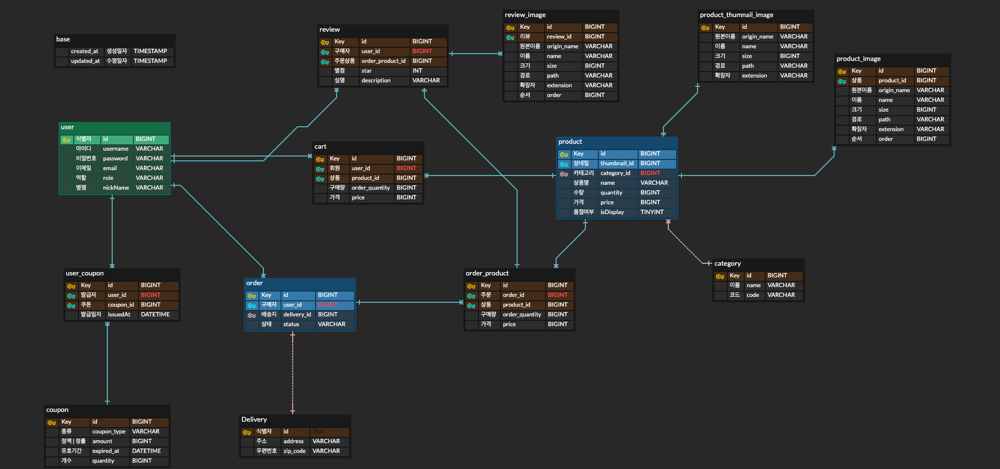

### 커머스 프로젝트

### 실행 방법(MAC)
1. chmod +x dockerize.sh 
2. ./dockerize.sh
3. docker-compose up -d

### ERD V1.1

### 기능 리스트

**회원**
- [x]  회원 가입
- [x] 로그인, 로그아웃
  - 일반 사용자
  - 판매업자
  - 관리자
- [ ] 멤버십 등급

 
 **주문**
- [x] 주문 [일반 사용자]
  - [ ] 쿠폰 사용
    - 쿠폰 정책 (쿠폰 사용을 허용, 불가 상품 등.)
- [ ] 주문 목록 조회
  - 일자
  - 금액
- [ ] 결제
  - 등급 별 할인 정책
- [ ] 배송 처리

**상품** [판매업자]
- [ ] 상품 올리기(이미지 포함)
- [ ] 상품 수정
- [ ] 상품 삭제
- [ ] 상품 조회
  - 검색
    - 가격
    - 카테고리
    - ..

**배송**

### policy
 
- 맴버십 혜택
  - VVIP
  - VIP
  - 골드
  - 실버
  - 그린

### 챙겨야 할 것
- 좋아요, 싫어요, 조회수 (redis ? mysql) - ttl?
- 카테고리 (재귀 쿼리)