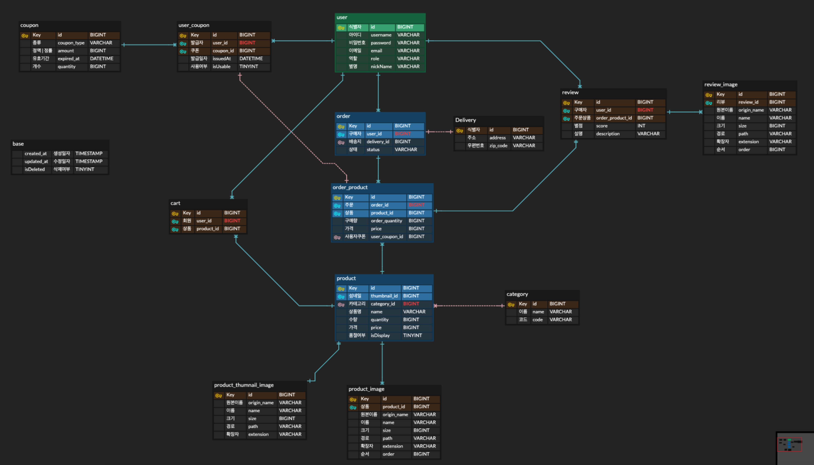

## 커머스 프로젝트 

### `현재 코드 커버리지: 69`

### 실행 방법(MAC) **[docker 필수]**
1. chmod +x dockerize.sh 
2. ./dockerize.sh
3. docker-compose up -d

### ERD V3

### 기능 리스트 V1.1

**회원** 
- [x]  회원 가입
- [x] 로그인, 로그아웃
  - 사용자 ROLE_USER
  - 판매업자 ROLE_OWNER
  - 관리자 ROLE_ADMIN

**장바구니**
- [x] 추가 [사용자]
- [x] 조회 [사용자] - 동적 검색 및 정렬
   - 담은 일자 (상한, 하한)
   - 정렬 (생성 일자)
- [x] 삭제 [사용자]

 **주문**
- [x] 주문 [사용자]
  - [x] 쿠폰 사용 [한 상품에 한개만 이용 가능]
- [ ] 주문 목록 조회 [사용자] - 동적 검색 및 정렬 [start]
  - 조건
    - 일자 (하한 - 상한)
    - 금액 (하한 - 상한)
    - 배송 기준
  - 정렬
    - 일자
    - 금액
- [ ] 주문 취소
  - 배송 상태에 따른 규제
- [ ] 결제 [사용자]
  - 등급 별 할인 정책

**상품**
- [x] 상품 생성(섬네일, 이미지 포함) [판매업자]
- [x] 상품 수정 [판매업자]
- [x] 상품 삭제 [판매업자]
- [x] 상세 조회 [사용자]
- [x] 전체 조회 [사용자] - 동적 검색 및 정렬
   - 가격 (하한 - 상한)
   - 이름
   - 정렬 (가격, 생성일자)
- [x] 찜 추가 및 취소
  - 찜 카운팅
- [x] 상품 조회수 카운팅

**쿠폰**
- [x]  생성 [판매업자]
- [x]  발급 [사용자]
- [x] 전체 조회 [사용자] - 동적 검색 및 정렬
  - 조건
    - 발급 일자 (하한 - 상한)
    - 만료 일자 (하한 - 상한)
    - 쿠폰 종류
    - 사용 여부
  - 정렬
    - 발급 일자
    - 만료 일자
    
